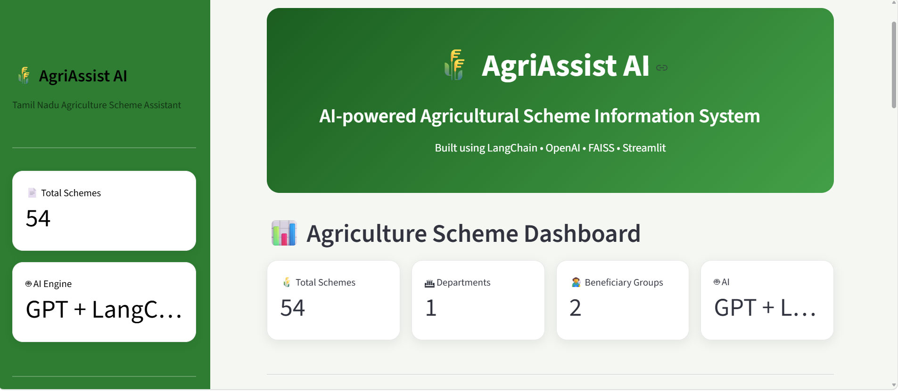
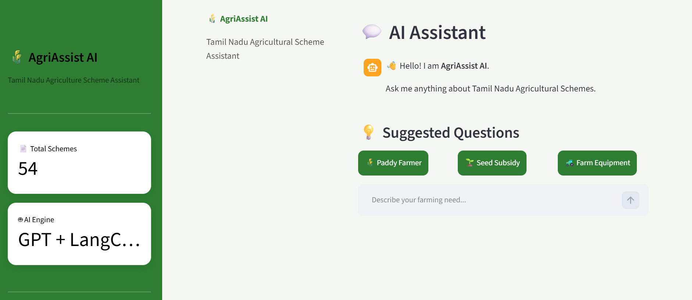
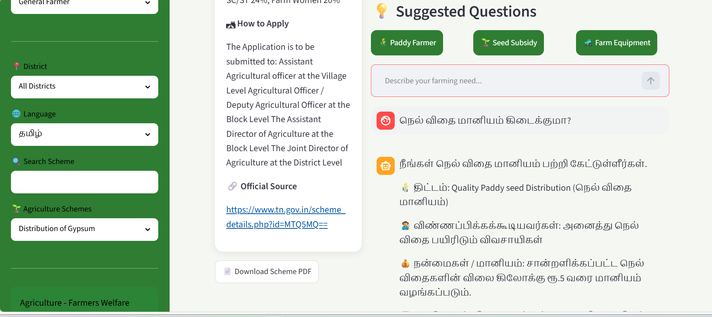
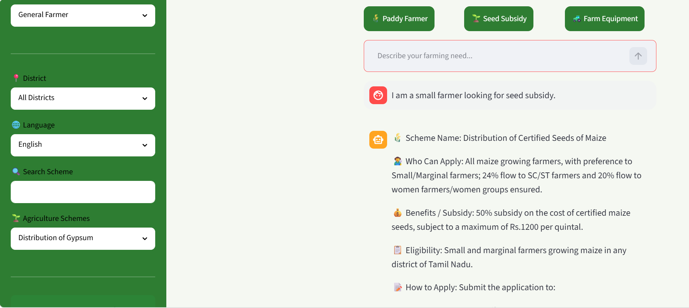

# 🌾 AgriAssist AI

## AI-Powered Agricultural Scheme Information System

AgriAssist AI is an intelligent Retrieval-Augmented Generation (RAG) application that helps farmers and citizens easily explore Tamil Nadu Government Agricultural Schemes through natural language conversations.

Instead of manually searching government websites, users can ask questions such as:

* What seed subsidy schemes are available?
* How can I apply for farmer training?
* Who is eligible for Gypsum subsidy?

The application retrieves relevant government scheme information using a hybrid retrieval pipeline and generates accurate, context-aware answers using OpenAI GPT.

---

# Features

* 🌾 Tamil Nadu Government Agriculture Scheme Explorer
* 🤖 AI-powered conversational assistant
* 🔍 Semantic Vector Retrieval
* 📚 LangChain-based RAG Pipeline
* 🧠 OpenAI GPT Integration
* 📄 PDF download for scheme details
* 📊 Interactive Dashboard
* 🔐 Secure API key management using `.env`
* 🎨 Professional Streamlit Interface
* 📁 Structured JSON Knowledge Base

---

# System Architecture

```
Tamil Nadu Government Website
            │
            ▼
       Web Scraper
            │
            ▼
      Structured JSON
            │
     OpenAI Embeddings
            │
            ▼
       FAISS Vector DB
            │
            ▼
   LangChain Retriever
            │
            ▼
        OpenAI GPT
            │
            ▼
    Streamlit Dashboard
```

---

# Technology Stack

| Layer           | Technology               |
| --------------- | ------------------------ |
| Frontend        | Streamlit                |
| Backend         | Python 3.14              |
| LLM             | OpenAI GPT               |
| Framework       | LangChain                |
| Embeddings      | text-embedding-3-small   |
| Vector Database | FAISS                    |
| Observability   | LangSmith                |
| Web Scraping    | Requests + BeautifulSoup |
| PDF Generation  | ReportLab                |

---
## 🏠 Home Screen



---

## 💬 AI Chatbot



---

## 🌐 Tamil Language Support




## 🏠 Home Screen


## 💬 AI Chatbot


## 🌐 Tamil Language Support


## 🌐 English Language Support




# Project Structure

```
TN_Agriculture_AI/

├── app.py
├── .env
├── requirements.txt
│
├── config/
├── scraper/
├── data/
├── vectorstore/
├── llm/
├── ui/
├── db/
```

---

# Installation

## Clone Repository

```bash
git clone <repository-url>
cd TN_Agriculture_AI
```

## Create Virtual Environment

```bash
python -m venv venv
```

Activate the environment.

Windows

```bash
venv\Scripts\activate
```

Linux / macOS

```bash
source venv/bin/activate
```

---

## Install Dependencies

```bash
pip install -r requirements.txt
```

---

## Configure Environment Variables

Create a `.env` file.

```
OPENAI_API_KEY=your_openai_api_key

LANGCHAIN_API_KEY=your_langsmith_key

LANGCHAIN_TRACING_V2=true

LANGCHAIN_PROJECT=AgriAssist_AI
```

---

## Build Vector Database

```bash
python vectorstore/create_vectorstore.py
```

---

## Run Application

```bash
streamlit run app.py
```

---
## Generate Vector Database

After cloning:

python vectorstore/create_vectorstore.py

This creates:

db/faiss_index/

The generated index is excluded from Git using `.gitignore`.

# Workflow

1. Scrape Tamil Nadu Government Agriculture schemes.
2. Parse structured information.
3. Clean and normalize data.
4. Store as JSON.
5. Generate embeddings using OpenAI.
6. Store vectors in FAISS.
7. Retrieve relevant schemes using Hybrid Retrieval.
8. Generate AI response using GPT.
9. Display results in Streamlit.
10. Included chatbot interaction in both english and tamil
---
## Tamil Language Support

Example Query:

நெல் விதை மானியம் கிடைக்குமா?

Output:

- திட்டத்தின் பெயர்
- தகுதி
- நன்மைகள்
- விண்ணப்பிக்கும் முறை
# 🌐 Prompt Engineering & Multilingual Support

## System Prompt

AgriAssist AI uses a structured prompt that personalizes responses based on:

* Preferred Language
* Farmer Category
* District
* Farmer Intent
* Farmer Question
* Retrieved Tamil Nadu Government Scheme Context

The assistant is instructed to:

* Answer **only** using the retrieved government scheme information.
* Reply in the **same language** as the farmer (English or Tamil).
* Recommend the **most relevant** scheme(s).
* Never invent scheme names, benefits, eligibility, or application procedures.
* Clearly state when no matching scheme exists.

---

## Example – Tamil Query

**Input**

```
Farmer Category:
சிறு விவசாயி

District:
சேலம்

Question:
எனக்கு விதை மானியம் கிடைக்குமா?
```

**Output**

🌾 **திட்டத்தின் பெயர்:** Certified Seed Distribution Programme

👨‍🌾 **தகுதியானவர்கள்:** சிறு மற்றும் குறைந்த நிலம் கொண்ட விவசாயிகள்

💰 **நன்மைகள்:** அரசு மானிய விலையில் தரமான விதைகள் வழங்கப்படும்.

📋 **தகுதி:** தகுதியான விவசாயிகள் தங்களது மாவட்ட வேளாண்மை அலுவலகத்தில் விண்ணப்பிக்கலாம்.

📝 **விண்ணப்பிக்கும் முறை:** அருகிலுள்ள வேளாண்மை விரிவாக்க அலுவலகம் அல்லது வேளாண்மை உதவி இயக்குநர் அலுவலகத்தில் விண்ணப்பிக்கலாம்.

🏛 **துறை:** Agriculture – Farmers Welfare Department

🔗 **அதிகாரப்பூர்வ இணையதளம்:** https://www.tn.gov.in/

📍 **சமீபத்திய தகவல்களை அருகிலுள்ள வேளாண்மை விரிவாக்க அலுவலகத்தில் சரிபார்க்கவும்.**

---
## 🌐 Multilingual Support

### English

**Query**

> I am a small farmer looking for seed subsidy.

**Response**


---

### Tamil

**Query**

> நான் ஒரு சிறு விவசாயி. விதை மானியம் வேண்டும்.

**Response**


## Prompt Design Highlights

* Context-aware Retrieval-Augmented Generation (RAG)
* Multilingual (English & Tamil)
* Farmer-profile personalization
* District-aware recommendations
* Hallucination prevention using retrieved context only
* Structured response formatting for better readability


# Future Enhancements

* Voice-based interaction
* Farmer login and saved history
* Scheme recommendation engine
* OCR support for uploaded documents
* Mobile application

---

# Author

**Dhivyaa Premkumar**

Buildathon Project – AgriAssist AI
